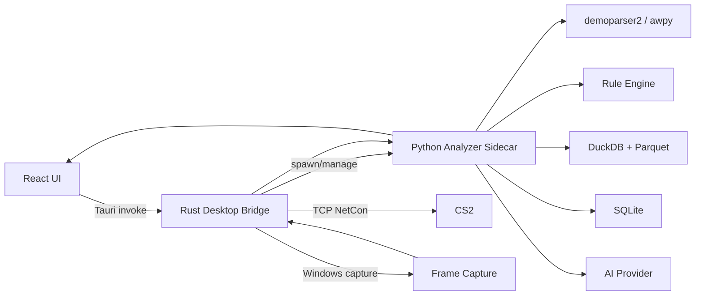

# 01 — System Architecture

## 1. 总体架构



## 2. 为什么采用三层

### React/Tauri UI
优点：
- 现代 UI
- 桌面文件权限
- 安装包体积通常比 Electron 小
- Rust 很适合做 Windows 原生 API、进程、socket、capture

### Python Analyzer
原因：
- demoparser2 Python binding
- awpy 生态
- Polars/DuckDB 非常适合大量 tick 数据
- AI SDK 和数据分析开发速度快

### Rust Native Bridge
只做“必须接近系统”的事情：
- CS2 进程启动/查找
- NetCon TCP
- 窗口 HWND
- Windows Capture
- sidecar 生命周期
- OS credential

不要把战术规则写进 Rust。

## 3. 进程模型

```text
cs2-ai-coach.exe
 ├─ WebView / React
 ├─ Tauri Rust process
 │   ├─ Cs2ProcessManager
 │   ├─ NetConClient
 │   ├─ CaptureManager
 │   └─ AnalyzerSidecarManager
 └─ analyzer-sidecar.exe
     ├─ FastAPI
     ├─ parser
     ├─ analytics
     ├─ jobs
     ├─ sqlite
     ├─ parquet
     └─ AI client
```

## 4. Sidecar 通信

推荐：

- sidecar bind: `127.0.0.1`
- 启动时随机端口
- Tauri 生成随机 session token
- token 通过环境变量传 sidecar
- Browser renderer **不直接**知道 analyzer token
- Renderer 调 Tauri `invoke`
- Tauri 代理到 sidecar

原因：
- 降低本机其他进程随便调用 analyzer 的风险
- 不需要处理 renderer CORS/secret
- 可以统一 timeout/cancel/error mapping

### 为什么仍使用 HTTP
相比 stdin/stdout JSON-RPC：
- FastAPI/Pydantic 开发快
- streaming progress / health check 简单
- 调试方便
- 未来云端化时 API contract 可复用

## 5. 关键 Adapter

### DemoParserAdapter

```text
parse_header(path)
parse_rounds(path)
parse_events(path, event_types)
parse_ticks(path, fields, tick_filter)
capabilities()
version()
```

实现：
- `Demoparser2Adapter`
- `AwpyAdapter`
- 后续可增加其他 parser

### Cs2ReplayAdapter

```text
connect()
load_demo(path)
seek_tick(tick, pause=true)
pause()
resume()
set_timescale(value)
focus_player(player_ref)
get_demo_info()
capabilities()
```

业务层不能直接拼 console command。

### CaptureAdapter

```text
list_targets()
select_target()
capture_frame()
capture_burst(plan)
health()
```

实现：
- `WindowsGraphicsCaptureAdapter`
- `DxgiDesktopDuplicationAdapter`

### AiProvider

```text
analyze_incident(packet, images) -> IncidentAnalysis
summarize_match(match_packet) -> MatchSummary
health()
```

首个实现可为 OpenAI Responses API，但 contract 与供应商解耦。

## 6. 架构依赖方向

只允许：

```text
UI -> Contracts
Rust adapters -> Contracts
Python API -> Application services -> Domain
Infrastructure -> Domain ports
Rules -> Domain
AI -> Domain facts/contracts
```

禁止：
- Domain import FastAPI
- Rules import UI
- Parser-specific dataframe schema泄漏到 UI
- AI SDK object 泄漏到业务层

## 7. 事件驱动工作流

长任务统一 Job：

```text
IMPORTED
  -> HASHING
  -> PARSING
  -> NORMALIZING
  -> RULE_ANALYSIS
  -> STRUCTURED_READY
  -> CAPTURE_PENDING
  -> CAPTURING
  -> AI_PENDING
  -> AI_ANALYZING
  -> COMPLETE
```

每步有：
- progress
- started_at
- finished_at
- retry_count
- error_code
- retryable
- input fingerprint
- output artifact ids

用户关闭应用后，能从持久化状态恢复。

## 8. 版本化

必须记录：

- app_version
- parser_name
- parser_version
- normalization_schema_version
- ruleset_version
- ai_schema_version
- prompt_version
- model
- game/client version（能读到则记录）

这使“同一 Demo 为什么两个月后结论不同”可解释。
