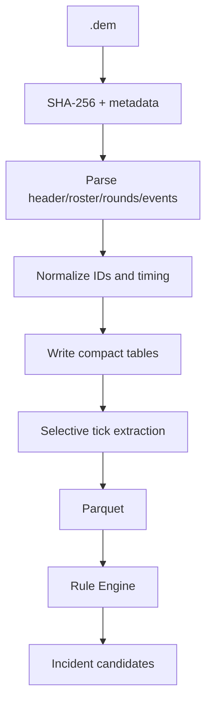

# 02 — Demo Data Pipeline

## 1. 数据流



## 2. Parser 选择

### demoparser2
适合作为底层：
- Rust 核心
- Python/JavaScript binding
- 查询式解析
- 能读取 event 和 ticks

### awpy
适合作为高层分析库：
- rounds
- kills
- damages
- grenades
- smokes
- infernos
- shots
- footsteps
- ticks
- visibility/nav 等分析工具

工程策略：

```text
默认使用 AwpyAdapter 提供高层标准表
        ↓ 如果某字段缺失
Demoparser2Adapter 做精确补充
```

不要在整个项目到处直接调用两者。

## 3. Demo Import

### 输入验证
- extension `.dem`，或下载得到的 `.zip`（内含一个 `.dem`）
- 文件可读
- size > 0
- 计算 **demo 内容** 的 SHA-256（zip 会先安全解出 `.dem` 再哈希；同一场的 zip/dem 去重一致）
- 记录用户原始路径（可为 zip）
- 纯 `.dem` 不默认复制大文件
- `.zip` 解压到 `runtime/extracted/<dem-sha256>/`（防 zip-slip，拒绝多 dem 歧义，限制单文件大小）
- 如果用户希望“管理 Demo 库”，可选择复制/移动到 managed storage

### 去重
`demo_sha256` 唯一（基于 `.dem` 字节，不是 zip 外壳）。

同一文件再次导入：
- 不重复解析
- 可重新运行新 ruleset / AI version

## 4. 标准化 Domain IDs

### Match ID
内部 UUID，和文件 hash 分离。

### Player ID
优先：
- SteamID64 / account id
- fallback: demo-local player key

永远不要只用 nickname 作为稳定 ID。

### Round ID
`match_id + round_number`

### Event ID
内部 UUID，保留：
- source event type
- raw tick
- round id
- actor id
- target id
- source payload excerpt

## 5. Timing

CS2 Demo 的 tick、game time、round time、subtick 信息要原样保留。

Domain 建议同时保存：

```text
tick
demo_time_ms?
round_time_ms?
game_time?
source_clock_kind
```

**不要假定所有 Demo 都是同一 tick rate。**

业务展示：
- 以 round-relative 时间最直观
- seek 时使用 parser 与实际回放验证过的 raw tick

## 6. 建议标准表

### `matches`
- id
- demo_sha256
- demo_path
- source
- map_name
- parser_name
- parser_version
- imported_at
- parse_status

### `players`
- id
- match_id
- steam_id
- account_id
- nickname
- team

### `rounds`
- id
- match_id
- number
- start_tick
- freeze_end_tick
- end_tick
- winner
- win_reason
- bomb_site
- t_score_before
- ct_score_before

### `kills`
- event_id
- round_id
- tick
- attacker_id
- victim_id
- assister_id
- weapon
- headshot
- penetrated
- attacker_position
- victim_position

### `damages`
- tick
- attacker_id
- victim_id
- hp_damage
- armor_damage
- weapon

### `shots`
- tick
- player_id
- weapon
- position
- view_angle_if_available

### `grenades`
- throw_tick
- player_id
- grenade_type
- start_position
- end_position
- detonate_tick

### `bomb_events`
- tick
- type
- player_id
- site

### `footsteps`
- tick
- player_id
- position

### `player_tick`
高频，仅放 Parquet：
- match_id
- round_id
- tick
- player_id
- x/y/z
- yaw/pitch if available
- hp/armor
- is_alive
- weapon
- team
- money/equipment fields if needed

## 7. 高频数据策略

一场 40 分钟比赛，在“10 人 × 64 tick/s”的简单上界模型下约有 1,536,000 player-tick rows；如果按 128 tick 等价采样，上界约 3,072,000 rows。

因此：

- 不把完整 player_tick 塞进 SQLite。
- 写 Parquet，按 `match_id/round_number` 分区或单 match 文件。
- 常规规则尽量使用事件表。
- 只有需要空间轨迹/可见性/距离时查询 tick。

## 8. Tick Sampling

不是每个规则都需要每 tick。

三档：

### L0 — event-only
- opening death
- trade
- clutch
- bomb
- utility
- economy

### L1 — sparse ticks
例如每 N 个 tick 抽样：
- rotation path
- spacing trend
- site approach

### L2 — local high resolution window
只在 Incident 附近：
- death ± 5 s
- first contact
- repeat peek
- crosshair / POV visual context

## 9. Compatibility

Parser 经常受 CS2 更新影响。

必须做：
- parser version stored
- parsing error taxonomy
- fixture demo regression
- “unsupported demo/build” UI 状态
- parser adapter replaceable
- release checklist 中加“新 CS2 build smoke test”

建议错误码：
- `DEMO_INVALID`
- `DEMO_UNSUPPORTED_VERSION`
- `PARSER_CRASH`
- `PARSER_SCHEMA_CHANGED`
- `MISSING_EXPECTED_EVENT`
- `PLAYER_ID_UNRESOLVED`
- `TICK_MAPPING_UNCERTAIN`
