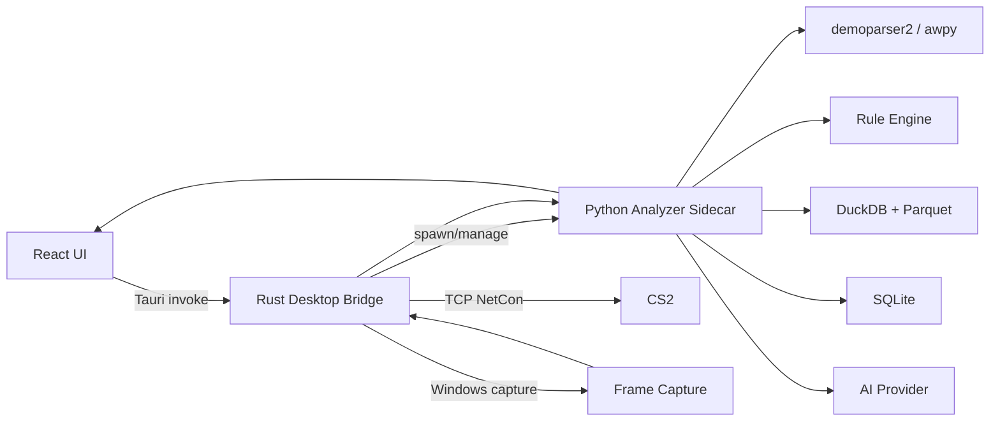
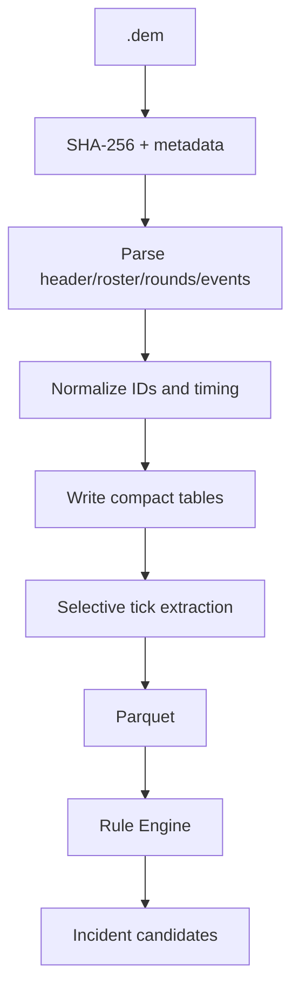

# CS2 AI Coach — 完整技术设计与 Cursor 开发方案

> 日常开发请优先阅读编号文档 `docs/00_*.md` … `docs/10_*.md` 与 [`docs/README.md`](README.md)。本文件是离线参考用的合并稿。

---

<!-- SOURCE: README.md -->

# CS2 AI Coach — Full Technical Design (concatenated dump)

> Prefer the numbered docs under `docs/00_*.md` … `docs/10_*.md` and the index in `docs/README.md`. This file is a single-file concatenation kept for offline reference.

**基线日期：2026-10-09**

本包是一套面向 Windows-first 桌面应用的可实施技术设计，目标是构建一个：

- 导入并解析 CS2 `.dem`
- 从结构化事件中发现值得复盘的决策点
- 通过外部控制让 CS2 播放/跳转 Demo
- 捕捉 CS2 回放画面
- 将结构化事实 + 关键帧交给视觉/语言模型
- 输出可追溯、可点击回放、可长期统计的 AI 教练建议

## 1. 推荐实现路线

**Desktop UI**
- Tauri v2
- React + TypeScript
- Vite
- Tailwind CSS（可选）
- TanStack Query
- Zustand

**Native desktop bridge**
- Rust / Tauri `src-tauri`
- 负责：CS2 启动、进程发现、NetCon、窗口发现、Windows 屏幕捕获、文件系统、安全凭据桥接

**Analyzer sidecar**
- Python 3.12
- FastAPI + Uvicorn
- Pydantic v2
- Polars
- demoparser2
- awpy
- DuckDB
- SQLite
- OpenAI Python SDK

**Storage**
- SQLite：应用状态、任务、比赛索引、Incident、AI 分析结果
- Parquet：tick/player-state/大体量事件表
- DuckDB：对 Parquet 做本地查询和跨比赛聚合

## 2. 架构原则

1. Demo 是事实源；AI 不是事实源。
2. 先结构化筛选，再做视觉分析。
3. 不逐帧把整场录像发给 AI。
4. 所有 AI 结论必须带 evidence。
5. 不向 CS2 注入 DLL，不读进程内存，不做实时比赛辅助。
6. 所有 CS2 命令统一经 `Cs2ReplayAdapter`，避免 Valve 更新后影响业务层。
7. 所有 Demo 解析统一经 `DemoParserAdapter`，避免依赖单个解析库。
8. 所有模型调用统一经 `AiProvider`，避免供应商锁定。
9. Renderer 永远不持有 AI API Key。
10. 第一版优先做到“可信”和“可复现”，再追求花哨功能。

## 3. 先读哪些文件

按这个顺序：

1. `docs/00_PRODUCT_SCOPE.md`
2. `docs/01_SYSTEM_ARCHITECTURE.md`
3. `docs/02_DEMO_PIPELINE.md`
4. `docs/03_CS2_CONTROL_AND_CAPTURE.md`
5. `docs/04_ANALYSIS_ENGINE.md`
6. `docs/05_AI_PIPELINE.md`
7. `docs/06_DATA_AND_API.md`
8. `docs/07_TEST_SECURITY_RELEASE.md`
9. `TASKS.md`
10. `CURSOR_PROMPTS.md`

然后把整个目录作为新仓库的文档基线，先让 Cursor 完成 `TASKS.md` 的 P0，**不要一口气生成完整产品**。

## 4. 推荐仓库结构

```text
cs2-ai-coach/
├─ AGENTS.md
├─ README.md
├─ TASKS.md
├─ apps/
│  └─ desktop/
│     ├─ src/
│     └─ src-tauri/
│        └─ src/
│           ├─ cs2/
│           ├─ capture/
│           ├─ sidecar/
│           ├─ commands/
│           └─ security/
├─ services/
│  └─ analyzer/
│     ├─ app/
│     │  ├─ api/
│     │  ├─ demo/
│     │  ├─ domain/
│     │  ├─ rules/
│     │  ├─ keyframes/
│     │  ├─ ai/
│     │  ├─ storage/
│     │  └─ jobs/
│     └─ tests/
├─ packages/
│  └─ contracts/
│     ├─ schemas/
│     └─ generated/
├─ docs/
├─ .cursor/
│  └─ rules/
├─ runtime/             # gitignore
└─ scripts/
```

## 5. 最小可发布闭环

```text
导入 Demo
  ↓
解析 & 标准化
  ↓
回合/击杀/伤害/投掷物时间线
  ↓
规则引擎发现 Incident
  ↓
用户点“在 CS2 中查看”
  ↓
CS2 跳到目标 tick 前
  ↓
可选：捕获 3~6 张关键帧
  ↓
AI 结合事实 + 图片分析
  ↓
展示结论 / evidence / 建议
```

## 6. 明确不做

MVP 不做：

- 实时比赛读内存
- DLL 注入
- 自动瞄准/敌人位置提示
- 绕过 Trusted Mode / VAC
- 对正在进行的竞技比赛提供信息优势
- 直接把整场视频逐帧上传模型
- 在 renderer 里保存 API Key

这些边界既降低 VAC/安全风险，也让产品定位保持在离线复盘工具。

## 7. 资料基线

设计时核实的公开资料：

- demoparser2: https://github.com/LaihoE/demoparser
- awpy: https://github.com/pnxenopoulos/awpy
- Valve `-netconport`: https://developer.valvesoftware.com/wiki/CHILLMODEA/Pages/Command_line_options
- Steam CS2 Trusted Mode: https://help.steampowered.com/en/faqs/view/09A0-4879-4353-EF95
- Windows Graphics Capture: https://learn.microsoft.com/en-us/windows/apps/develop/media-authoring-processing/screen-capture
- DXGI Desktop Duplication: https://learn.microsoft.com/en-us/windows-hardware/drivers/display/desktop-duplication-api
- Tauri Sidecar: https://v2.tauri.app/develop/sidecar/
- OpenAI Responses API: https://developers.openai.com/api/reference/responses/overview
- OpenAI Structured Outputs: https://developers.openai.com/api/docs/guides/structured-outputs
- Cursor Rules: https://cursor.com/docs/rules

详细来源和“可能随更新变化的接口”见各设计文档。

---

<!-- SOURCE: docs/00_PRODUCT_SCOPE.md -->

# 00 — Product Scope

## 1. 产品目标

构建一个 Windows 桌面端 CS2 AI 教练：

> 用户导入一场 Demo，软件自动找出关键失误/优秀决策，通过结构化数据解释“发生了什么”，通过 CS2 回放关键帧解释“现场长什么样”，最后给出可执行的训练建议。

产品价值不是“再做一个数据面板”，而是把：

- 统计
- 战术上下文
- 复盘定位
- 视觉理解
- 教练建议

合成一个工作流。

## 2. 目标用户

### P0 / P1
- 普通竞技玩家
- FACEIT 玩家
- 想系统复盘个人问题的玩家

### 后续
- 半职业队伍
- 教练/分析师
- 内容创作者
- 训练营

## 3. 核心用户故事

### US-001 导入
我可以拖入 `.dem`，软件识别比赛、地图、选手和回合。

### US-002 选择自己
我可以指定 Demo 里的哪个 Steam ID / 玩家是“我”。

### US-003 时间线
我可以看到每回合：
- 击杀
- 死亡
- 伤害
- 投掷物
- 炸弹事件
- 首杀
- 关键人数变化

### US-004 自动发现问题
软件能自动标记：
- 首死
- 未被补枪的死亡
- 人数优势后送掉
- 孤立接触
- 重复 peek
- 无支援进点
- 残局关键错误
- 关键道具时机问题

注意：这些只是候选 Incident。规则必须能解释证据，不能用模糊“AI 感觉”。

### US-005 在 CS2 查看
点击某个 Incident：
- 打开或连接 CS2
- 加载对应 Demo
- 跳到事件之前
- 暂停或慢速播放
- 尽量切换到目标玩家 POV

### US-006 AI 分析
用户请求 AI 后：
- 取 3~6 张关键帧
- 连同结构化事实发送模型
- 返回事实、观察、推断、建议、置信度、不确定项

### US-007 长期画像
多场比赛后显示：
- 哪些错误重复出现
- 地图/阵营/位置维度分布
- 开局、中期、残局的表现
- 建议训练主题

## 4. MVP 边界

### 必须
- Windows 11 优先
- 本地 `.dem`
- 至少支持常见竞技 Demo
- Demo 结构化解析
- 时间线
- Incident 规则引擎
- CS2 外部控制
- 单帧/关键帧捕捉
- AI structured output
- 本地报告存储
- 失败可恢复

### 可以延后
- 账号登录
- 云同步
- 队伍协作
- 视频导出
- 自动语音讲解
- 付费系统
- 多语言
- macOS/Linux

### 禁止进入 MVP
- 进程注入
- 游戏内实时敌人情报
- 读取游戏内存
- 规避 VAC
- 对在线比赛进行实时战术提示

## 5. 成功标准

MVP 成功不是“功能很多”，而是以下闭环稳定：

1. 选一场 Demo。
2. 解析成功。
3. 选择玩家。
4. 看到至少一批可解释的 Incident。
5. 点击 Incident 能定位到对应 Demo 片段。
6. 能抓到正确画面。
7. AI 输出与结构化事实不冲突。
8. 用户能知道“为什么这个建议出现”。

## 6. 非功能目标

- 离线结构化分析不依赖云端。
- API 暂时不可用时，仍可使用统计和规则分析。
- Demo parser 更新后可单独替换。
- CS2 控制命令更新后可单独替换。
- AI 模型更换后不需要改 UI 数据结构。
- 单个失败 Incident 不导致整场分析失败。

---

<!-- SOURCE: docs/01_SYSTEM_ARCHITECTURE.md -->

# 01 — System Architecture

## 1. 总体架构



## 2. 为什么采用三层

### React/Tauri UI
优点：
- 现代 UI
- 桌面文件权限
- 安装包体积通常比 Electron 小
- Rust 很适合做 Windows 原生 API、进程、socket、capture

### Python Analyzer
原因：
- demoparser2 Python binding
- awpy 生态
- Polars/DuckDB 非常适合大量 tick 数据
- AI SDK 和数据分析开发速度快

### Rust Native Bridge
只做“必须接近系统”的事情：
- CS2 进程启动/查找
- NetCon TCP
- 窗口 HWND
- Windows Capture
- sidecar 生命周期
- OS credential

不要把战术规则写进 Rust。

## 3. 进程模型

```text
cs2-ai-coach.exe
 ├─ WebView / React
 ├─ Tauri Rust process
 │   ├─ Cs2ProcessManager
 │   ├─ NetConClient
 │   ├─ CaptureManager
 │   └─ AnalyzerSidecarManager
 └─ analyzer-sidecar.exe
     ├─ FastAPI
     ├─ parser
     ├─ analytics
     ├─ jobs
     ├─ sqlite
     ├─ parquet
     └─ AI client
```

## 4. Sidecar 通信

推荐：

- sidecar bind: `127.0.0.1`
- 启动时随机端口
- Tauri 生成随机 session token
- token 通过环境变量传 sidecar
- Browser renderer **不直接**知道 analyzer token
- Renderer 调 Tauri `invoke`
- Tauri 代理到 sidecar

原因：
- 降低本机其他进程随便调用 analyzer 的风险
- 不需要处理 renderer CORS/secret
- 可以统一 timeout/cancel/error mapping

### 为什么仍使用 HTTP
相比 stdin/stdout JSON-RPC：
- FastAPI/Pydantic 开发快
- streaming progress / health check 简单
- 调试方便
- 未来云端化时 API contract 可复用

## 5. 关键 Adapter

### DemoParserAdapter

```text
parse_header(path)
parse_rounds(path)
parse_events(path, event_types)
parse_ticks(path, fields, tick_filter)
capabilities()
version()
```

实现：
- `Demoparser2Adapter`
- `AwpyAdapter`
- 后续可增加其他 parser

### Cs2ReplayAdapter

```text
connect()
load_demo(path)
seek_tick(tick, pause=true)
pause()
resume()
set_timescale(value)
focus_player(player_ref)
get_demo_info()
capabilities()
```

业务层不能直接拼 console command。

### CaptureAdapter

```text
list_targets()
select_target()
capture_frame()
capture_burst(plan)
health()
```

实现：
- `WindowsGraphicsCaptureAdapter`
- `DxgiDesktopDuplicationAdapter`

### AiProvider

```text
analyze_incident(packet, images) -> IncidentAnalysis
summarize_match(match_packet) -> MatchSummary
health()
```

首个实现可为 OpenAI Responses API，但 contract 与供应商解耦。

## 6. 架构依赖方向

只允许：

```text
UI -> Contracts
Rust adapters -> Contracts
Python API -> Application services -> Domain
Infrastructure -> Domain ports
Rules -> Domain
AI -> Domain facts/contracts
```

禁止：
- Domain import FastAPI
- Rules import UI
- Parser-specific dataframe schema泄漏到 UI
- AI SDK object 泄漏到业务层

## 7. 事件驱动工作流

长任务统一 Job：

```text
IMPORTED
  -> HASHING
  -> PARSING
  -> NORMALIZING
  -> RULE_ANALYSIS
  -> STRUCTURED_READY
  -> CAPTURE_PENDING
  -> CAPTURING
  -> AI_PENDING
  -> AI_ANALYZING
  -> COMPLETE
```

每步有：
- progress
- started_at
- finished_at
- retry_count
- error_code
- retryable
- input fingerprint
- output artifact ids

用户关闭应用后，能从持久化状态恢复。

## 8. 版本化

必须记录：

- app_version
- parser_name
- parser_version
- normalization_schema_version
- ruleset_version
- ai_schema_version
- prompt_version
- model
- game/client version（能读到则记录）

这使“同一 Demo 为什么两个月后结论不同”可解释。

---

<!-- SOURCE: docs/02_DEMO_PIPELINE.md -->

# 02 — Demo Data Pipeline

## 1. 数据流



## 2. Parser 选择

### demoparser2
适合作为底层：
- Rust 核心
- Python/JavaScript binding
- 查询式解析
- 能读取 event 和 ticks

### awpy
适合作为高层分析库：
- rounds
- kills
- damages
- grenades
- smokes
- infernos
- shots
- footsteps
- ticks
- visibility/nav 等分析工具

工程策略：

```text
默认使用 AwpyAdapter 提供高层标准表
        ↓ 如果某字段缺失
Demoparser2Adapter 做精确补充
```

不要在整个项目到处直接调用两者。

## 3. Demo Import

### 输入验证
- extension `.dem`
- 文件可读
- size > 0
- 计算 SHA-256
- 记录原路径
- 不默认复制大文件
- 如果用户希望“管理 Demo 库”，可选择复制/移动到 managed storage

### 去重
`demo_sha256` 唯一。

同一文件再次导入：
- 不重复解析
- 可重新运行新 ruleset / AI version

## 4. 标准化 Domain IDs

### Match ID
内部 UUID，和文件 hash 分离。

### Player ID
优先：
- SteamID64 / account id
- fallback: demo-local player key

永远不要只用 nickname 作为稳定 ID。

### Round ID
`match_id + round_number`

### Event ID
内部 UUID，保留：
- source event type
- raw tick
- round id
- actor id
- target id
- source payload excerpt

## 5. Timing

CS2 Demo 的 tick、game time、round time、subtick 信息要原样保留。

Domain 建议同时保存：

```text
tick
demo_time_ms?
round_time_ms?
game_time?
source_clock_kind
```

**不要假定所有 Demo 都是同一 tick rate。**

业务展示：
- 以 round-relative 时间最直观
- seek 时使用 parser 与实际回放验证过的 raw tick

## 6. 建议标准表

### `matches`
- id
- demo_sha256
- demo_path
- source
- map_name
- parser_name
- parser_version
- imported_at
- parse_status

### `players`
- id
- match_id
- steam_id
- account_id
- nickname
- team

### `rounds`
- id
- match_id
- number
- start_tick
- freeze_end_tick
- end_tick
- winner
- win_reason
- bomb_site
- t_score_before
- ct_score_before

### `kills`
- event_id
- round_id
- tick
- attacker_id
- victim_id
- assister_id
- weapon
- headshot
- penetrated
- attacker_position
- victim_position

### `damages`
- tick
- attacker_id
- victim_id
- hp_damage
- armor_damage
- weapon

### `shots`
- tick
- player_id
- weapon
- position
- view_angle_if_available

### `grenades`
- throw_tick
- player_id
- grenade_type
- start_position
- end_position
- detonate_tick

### `bomb_events`
- tick
- type
- player_id
- site

### `footsteps`
- tick
- player_id
- position

### `player_tick`
高频，仅放 Parquet：
- match_id
- round_id
- tick
- player_id
- x/y/z
- yaw/pitch if available
- hp/armor
- is_alive
- weapon
- team
- money/equipment fields if needed

## 7. 高频数据策略

一场 40 分钟比赛，在“10 人 × 64 tick/s”的简单上界模型下约有 1,536,000 player-tick rows；如果按 128 tick 等价采样，上界约 3,072,000 rows。

因此：

- 不把完整 player_tick 塞进 SQLite。
- 写 Parquet，按 `match_id/round_number` 分区或单 match 文件。
- 常规规则尽量使用事件表。
- 只有需要空间轨迹/可见性/距离时查询 tick。

## 8. Tick Sampling

不是每个规则都需要每 tick。

三档：

### L0 — event-only
- opening death
- trade
- clutch
- bomb
- utility
- economy

### L1 — sparse ticks
例如每 N 个 tick 抽样：
- rotation path
- spacing trend
- site approach

### L2 — local high resolution window
只在 Incident 附近：
- death ± 5 s
- first contact
- repeat peek
- crosshair / POV visual context

## 9. Compatibility

Parser 经常受 CS2 更新影响。

必须做：
- parser version stored
- parsing error taxonomy
- fixture demo regression
- “unsupported demo/build” UI 状态
- parser adapter replaceable
- release checklist 中加“新 CS2 build smoke test”

建议错误码：
- `DEMO_INVALID`
- `DEMO_UNSUPPORTED_VERSION`
- `PARSER_CRASH`
- `PARSER_SCHEMA_CHANGED`
- `MISSING_EXPECTED_EVENT`
- `PLAYER_ID_UNRESOLVED`
- `TICK_MAPPING_UNCERTAIN`

---

<!-- SOURCE: docs/03_CS2_CONTROL_AND_CAPTURE.md -->

# 03 — CS2 Control and Capture

## 1. 总原则

只使用：
- 启动参数
- TCP console / NetCon
- Demo playback console commands
- Windows 屏幕/窗口捕捉

不使用：
- DLL injection
- process memory read/write
- game binary patch
- online-match overlay

Valve 的 Trusted Mode 明确限制第三方程序向 CS2 进程注入，因此这条边界是架构硬约束。

## 2. CS2 启动

推荐由 `Cs2ProcessManager`：

1. 检测 Steam
2. 检测 CS2 是否已运行
3. 检查 NetCon 是否可连接
4. 如需要用户重启，明确提示
5. 启动 CS2 时添加随机高位 `-netconport`

示意：

```text
steam.exe -applaunch 730 -netconport <ephemeral-port>
```

注意：
- Valve 文档说明 `-netconport <number>` 创建可远程访问的 server console。
- 因此应把它视为本机攻击面。
- 端口随机化。
- 只在分析会话期间开启。
- Windows 防火墙策略建议阻断外部网络访问。
- 不把端口/token上传日志。

## 3. NetCon Client

Rust 模块：

```text
Cs2NetConClient
- connect(address)
- send(command)
- read_until_idle()
- command(command, timeout)
- close()
```

必须处理：
- connection refused
- CS2 正在启动
- console 回包噪声
- 命令成功但没有结构化 ACK
- socket 断开
- CS2 重启

## 4. Demo Playback Adapter

支持能力探测，而不是假定永远存在。

目标 command family：
- `playdemo`
- `demo_pause`
- `demo_resume`
- `demo_togglepause`
- `demo_goto`
- `demo_gototick`
- `demo_timescale`
- `demo_info`

实际发布前要在当前 CS2 build 上跑 smoke test。

### Load demo

优先尝试绝对路径或已验证的 managed path。

如果 CS2 对任意路径行为不稳定：
- 将 Demo 复制到一个受控的 CS2 demo staging 目录
- 文件名使用 hash + 安全 ASCII
- 记录 original path -> staged path
- 分析结束可清理

## 5. Seek 设计

不要业务层直接：

```text
demo_gototick 12345
```

而是：

```text
seek_to_incident(incident_id)
```

内部：
1. 获取事件 tick
2. 减去 pre-roll
3. clamp 到 round start
4. pause
5. seek
6. 等待 seek settle
7. 设置 POV
8. set timescale
9. capture / resume

### Seek settle
Demo seek 不是“发命令后立刻画面已稳定”。

要建立状态：
- `SEEK_SENT`
- `SEEKING`
- `SETTLED`
- `POV_READY`

MVP 可先使用：
- 固定短 debounce
- screenshot hash/scene stability 检查

后续可通过 console/demo info 做更精确确认。

## 6. POV / spectator

封装：

```text
focus_player(PlayerReplayRef)
```

`PlayerReplayRef` 同时保存：
- steam/account id
- demo user id
- nickname
- round-local slot if resolved

原因：CS2 不同版本/不同 demo 的 spectator 定位方式可能变化。

第一阶段：
- 能跳到正确事件就算成功
- POV 自动切换是增强项
- POV 失败不应阻塞整个 Incident 分析，可要求用户手动切换后继续 capture

## 7. Windows Capture

### 首选：Windows.Graphics.Capture
微软官方 API 可捕捉 display 或 application window。

优点：
- 面向窗口
- Direct3D frame
- 可抓 snapshot / stream

### fallback：DXGI Desktop Duplication
适合：
- 全屏/桌面级 frame duplication
- 以 GPU surface 获取帧
- 可在程序级裁切 CS2 窗口区域

## 8. CaptureAdapter

```text
CaptureTarget
- kind: window | monitor
- hwnd?
- process_id?
- title?
- rect
- dpi_scale

CapturePlan
- target
- ticks[]
- player
- resolution_policy
- crop_policy
- settle_policy
```

### Burst capture
每个 Incident 不要无脑录视频。

例：
- t=-2.0s
- t=-0.8s
- t=-0.2s
- t=0.2s
- t=1.0s

实际选择应根据事件类型生成，而不是固定。

## 9. Capture quality checks

每张 frame 做本地质量检查：

- width/height > minimum
- 非全黑
- 非全白
- variance 足够
- 与上一张不是完全相同
- CS2 window still active
- 可选：HUD/画面 ROI 存在性检测

失败：
- 重试 capture
- 如果窗口最小化，提示恢复
- fallback capture adapter

## 10. Frame storage

路径示例：

```text
runtime/
  matches/<match_id>/
    captures/<incident_id>/
      000_tick_123456.webp
      001_tick_123490.webp
      manifest.json
```

manifest：
- tick
- capture_time
- window rect
- adapter
- resolution
- image sha256
- selected player
- seek command version

## 11. 不建议 MVP 上 HLAE

HLAE 对视频制作很强，但产品第一版不应该依赖注入/修改链路。

如果未来专门做“离线 cinematic export”：
- 独立可选模块
- 明确需要 insecure/offline 场景
- 与正常 CS2 竞技启动路径完全分离
- 不作为 AI Coach 核心依赖

---

<!-- SOURCE: docs/04_ANALYSIS_ENGINE.md -->

# 04 — Analysis Engine

## 1. 分层

分析分 4 层：

```text
Facts
  ↓
Derived Metrics
  ↓
Rule Incidents
  ↓
AI Interpretation
```

AI 永远在最后一层。

## 2. Facts

直接来自 Demo：
- 谁
- 什么时候
- 在哪里
- HP/armor
- 击杀/死亡
- damage
- weapon
- grenade
- bomb
- teammate alive state
- player positions

这些可以在 UI 标记为 `FACT`。

## 3. Derived Metrics

代码计算：
- alive counts
- distance to nearest teammate
- path/navigation distance
- trade time
- first contact / first damage
- economy delta
- utility inventory estimate
- time since last damage
- time between peeks
- rotation time
- player spacing

这些属于 `DERIVED_FACT`，必须可复算。

## 4. Incident 统一结构

```text
Incident
- id
- match_id
- round_id
- player_id
- type
- start_tick
- anchor_tick
- end_tick
- severity
- confidence
- rule_version
- evidence[]
- metrics{}
- capture_hint{}
- status
```

## 5. 首批 Rule

### R001 Opening Death
条件：
- 该回合第一名死亡者是目标玩家

输出：
- tick
- killer
- damage context
- teammates alive

这是事实型，不直接说“错误”。

### R002 Untraded Death
思路：
- 目标死亡
- 在可配置 trade window 中
- 队友没有击杀 killer
- 同时记录最近队友距离/LOS

注意：
“没有被补枪”不一定是死者错误。
AI 需要结合距离、位置和画面再判断责任。

### R003 Isolated Contact
思路：
- 目标与敌方发生首次伤害/射击接触
- 最近可支援队友的 nav distance / LOS 超过阈值
- 目标仍主动接触

阈值必须地图/情境可配置，不要硬编码成全局真理。

### R004 Advantage Throw
思路：
- 本队处于人数优势
- 目标发生高风险死亡
- 死亡后优势显著下降

输出事实：
- before_alive: 4v3
- after_alive: 3v3
- objective state
- time remaining
- support distance

AI 再解释“是否不必要”。

### R005 Repeat Peek After Damage
候选：
- 玩家一次接触受到明显伤害
- 短时间再次暴露到相同/相邻 threat lane
- 随后死亡或继续受伤

需要：
- tick positions
- view angle if reliable
- LOS/nav geometry
- capture frames

这是最适合“规则 + 视觉”联合的 Incident。

### R006 Unsupported Entry
候选：
- 玩家进入 site/choke 前后
- 队友距离/LOS 不足
- 没有有效 flash/smoke 支援
- 玩家成为首批交火目标

### R007 Utility Timing
例：
- 死亡时仍携带关键 utility
- 烟/闪投出后未能影响即将发生的 duel
- teammate flash 与 entry 严重脱节

要避免简单地“死了还有雷 = 错”。

### R008 Clutch Decision
识别 1vX：
- 路线
- 时间
- bomb state
- sequential duel
- sound/visibility context

优先让 AI 做解释，不要用规则强判。

## 6. Rule API

```text
Rule.evaluate(context) -> list[IncidentCandidate]

RuleMetadata:
- id
- version
- required_tables
- required_fields
- severity_policy
- default_thresholds
```

每个 rule：
- deterministic
- unit-testable
- configurable
- versioned

## 7. Evidence

Evidence 设计为引用，不复制所有数据：

```json
{
  "kind": "demo_event",
  "ref": "kill:uuid",
  "tick": 123456,
  "label": "player death"
}
```

```json
{
  "kind": "metric",
  "name": "nearest_teammate_nav_distance",
  "value": 812.4,
  "unit": "game_units"
}
```

```json
{
  "kind": "frame",
  "ref": "capture:uuid",
  "tick": 123420
}
```

AI result 的每条核心结论必须引用 evidence IDs。

## 8. Severity

不要把 severity 与 confidence 混为一谈。

### severity
影响程度：
- 1 minor
- 2 low
- 3 medium
- 4 high
- 5 critical

### confidence
证据充分度：
- 0.0 ~ 1.0

例如：
- “4v2 时首个主动死亡” severity 4
- 但如果 POV 画面没抓到，AI 对“为什么 peek”的 confidence 可能只有 0.55

## 9. Match Summary

聚合顺序：

```text
Incidents
 -> group by type
 -> normalize by opportunity
 -> map/side/phase breakdown
 -> repeated patterns
 -> top 3 training priorities
```

长期画像不能只按错误次数排序。

例如：
- 10 次 entry 中 4 次 unsupported
- 比 100 回合里 4 次 unsupported 更严重

因此应保存 denominator / opportunities。

---

<!-- SOURCE: docs/05_AI_PIPELINE.md -->

# 05 — AI Pipeline

## 1. AI 的职责

AI 负责：
- 解释
- 结合视觉上下文
- 判断多种可能原因
- 生成训练建议
- 把事实翻译成教练语言

AI 不负责：
- 猜 tick
- 猜击杀事件
- 猜血量
- 猜经济
- 猜谁是谁
- 从整场视频重新恢复 Demo facts

## 2. 推荐 API 形态

使用支持：
- text input
- image input
- JSON Schema structured output

的 Responses-style API。

OpenAI 当前 Responses API 支持 text/image input；Structured Outputs 可让输出遵循 JSON Schema。

模型名称不要硬编码进业务代码：

```text
AI_PROVIDER=openai
AI_MODEL_INCIDENT=<config>
AI_MODEL_SUMMARY=<config>
```

## 3. Incident Packet

发给模型的输入分 5 部分。

### A. Immutable facts
例如：
- map
- side
- round
- score
- target player
- anchor tick
- alive before/after
- hp
- weapon
- utility
- killer
- teammate distance

### B. Rule hypothesis
例如：
- candidate type: repeat_peek_after_damage
- rule confidence: 0.84

必须明确告诉模型：
“这只是规则候选，不是最终结论。”

### C. Evidence table
每个事实都有 evidence id。

### D. Keyframes
3~6 张优先，而非几十张。

### E. Coaching rubric
要求模型：
- 不重新发明事实
- 证据不足时输出 uncertainty
- 给 1~3 个具体建议
- 避免绝对化
- 区分个人错误、团队结构问题和合理风险

## 4. 输出模型

见：
`packages/contracts/schemas/coach_incident_analysis.schema.json`

逻辑：

```text
summary
severity
confidence
facts[]
observations[]
inferences[]
recommendations[]
uncertainties[]
```

### facts
只能重述输入事实，并带 evidence ids。

### observations
只描述图像可直接观察的内容。

### inferences
解释“可能为什么”。

### recommendations
可执行建议。

### uncertainties
缺失视角/信息不足/无法判断。

## 5. Prompt 版本

Prompt 不是写死在 Python string。

目录：

```text
services/analyzer/app/ai/prompts/
  incident_v001.md
  match_summary_v001.md
```

每次分析保存：
- prompt_version
- prompt_hash
- schema_version
- model

## 6. Hallucination 防线

### Rule 1
如果输出事实引用不存在 evidence id：
- validation fail
- 不展示
- 可重试一次

### Rule 2
如果模型说：
“你还有一颗烟”
但 packet 中没有 utility 证据：
- 标记 unsupported claim

### Rule 3
视觉 observation 不应伪装成 Demo fact。

### Rule 4
recommendation 可有观点，但 inference 要有 confidence。

### Rule 5
模型无法看到的信息必须允许 `"unknown"`。

## 7. AI 请求策略

### Incident 级
高质量视觉分析。

### Round 级
基于 Incident 输出，不重新传所有图片。

### Match 级
只传：
- round summaries
- incident summaries
- aggregate metrics

这样成本和噪声都低。

## 8. Keyframe Planner

Input：
- incident type
- anchor tick
- rule evidence
- local events

Output：

```text
KeyframePlan
- frame roles:
  - context_before
  - first_contact
  - damage_received
  - re_peek
  - death_or_resolution
- desired tick
- acceptable tick window
- preferred POV
```

如果一个 frame role 已被另一张图片覆盖，不重复。

## 9. 图片预处理

建议：
- 保留原始 frame
- AI 版本 resize 到合理上限
- WebP/JPEG
- 不做会隐藏战术信息的强 crop
- 可以另生成 ROI：
  - center view
  - radar
  - killfeed
  - utility/HUD

但 MVP 先发完整帧更简单。

## 10. API Key

### 开发版
用户输入个人 API key：
- Rust/OS credential store 保存
- Renderer 只显示 masked 状态
- Python sidecar 通过 Tauri 请求或启动时安全注入

### 商业版
不要让用户拿到平台主 key。
推荐：
- 自有 backend 作为 API broker
- 用户认证
- quota
- rate limit
- billing
- abuse control

## 11. Retry

只重试：
- network timeout
- 429 / transient
- provider 5xx
- structured output parsing临时失败

不无限重试。

AI job 需要：
- max_attempts
- exponential backoff
- cancel
- request fingerprint
- idempotency cache

## 12. Privacy

默认：
- Demo 本地保存
- 结构化解析本地
- 只有用户主动启用 AI 时才上传必要事实/图片
- UI 明确“将上传哪些内容”
- 支持删除本地 AI artifacts
- 日志不保存完整 API payload（debug opt-in 除外）

---

<!-- SOURCE: docs/06_DATA_AND_API.md -->

# 06 — Storage, Data Model and Local API

## 1. Storage 分工

### SQLite
放：
- settings
- demo index
- match metadata
- player identity
- rounds summary
- incidents
- jobs
- captures metadata
- AI analysis
- prompt/model versions

### Parquet
放：
- high-volume player ticks
- optional dense shot/trajectory tables
- derived spatial samples

### DuckDB
做：
- Parquet 查询
- cross-match aggregates
- longitudinal profile

## 2. Runtime layout

```text
%LOCALAPPDATA%/CS2AICoach/
  app.db
  logs/
  cache/
  matches/
    <match_id>/
      source.json
      rounds.parquet
      kills.parquet
      damages.parquet
      ticks/
        round_01.parquet
        round_02.parquet
      captures/
      analysis/
```

## 3. SQLite 核心表

### demos
- id
- sha256 UNIQUE
- original_path
- managed_path
- file_size
- imported_at

### matches
- id
- demo_id
- map_name
- parser_name
- parser_version
- schema_version
- parse_status
- created_at

### match_players
- id
- match_id
- steam_id
- account_id
- nickname
- team
- is_focus_player

### rounds
- id
- match_id
- round_no
- start_tick
- end_tick
- winner
- win_reason

### incidents
- id
- match_id
- round_id
- player_id
- type
- anchor_tick
- start_tick
- end_tick
- severity
- rule_confidence
- ruleset_version
- evidence_json
- status

### captures
- id
- incident_id
- tick
- role
- path
- sha256
- width
- height
- adapter
- created_at

### ai_analyses
- id
- incident_id
- provider
- model
- prompt_version
- schema_version
- request_fingerprint
- result_json
- confidence
- created_at

### jobs
- id
- type
- entity_id
- status
- progress
- attempt
- error_code
- error_message
- started_at
- finished_at

## 4. Migration

SQLite 使用显式 migration：
- `001_init.sql`
- `002_add_capture_manifest.sql`

规则：
- 已发布 migration 不修改
- 新变更只能增加 migration
- app 启动时自动备份旧 DB
- migration fail 时不继续启动写入

## 5. Analyzer Local API

Tauri -> sidecar。

### Health

`GET /v1/health`

Response：
```json
{
  "status": "ok",
  "version": "0.1.0",
  "parser": {
    "name": "awpy",
    "available": true
  }
}
```

### Import

`POST /v1/demos/import`

```json
{
  "path": "C:\\demos\\match.dem"
}
```

Response：
```json
{
  "demo_id": "uuid",
  "match_id": "uuid",
  "job_id": "uuid"
}
```

### Match

`GET /v1/matches/{match_id}`

### Rounds

`GET /v1/matches/{match_id}/rounds`

### Incidents

`GET /v1/matches/{match_id}/incidents?player_id=...`

### Run rules

`POST /v1/matches/{match_id}/analyze/rules`

```json
{
  "player_id": "uuid",
  "ruleset": "default"
}
```

### Register captured frame

`POST /v1/incidents/{incident_id}/frames`

Tauri 捕图后把 manifest/path 登记给 analyzer。

### AI analyze

`POST /v1/incidents/{incident_id}/analyze/ai`

```json
{
  "frame_ids": ["uuid", "uuid"],
  "force": false
}
```

### Jobs

`GET /v1/jobs/{job_id}`

### Cancel
`POST /v1/jobs/{job_id}/cancel`

## 6. Error envelope

统一：

```json
{
  "error": {
    "code": "DEMO_UNSUPPORTED_VERSION",
    "message": "This demo cannot be parsed by the installed parser.",
    "retryable": false,
    "details": {}
  },
  "request_id": "uuid"
}
```

Renderer 不解析 Python exception 字符串。

## 7. Tauri command boundary

React 只调用 typed commands，例如：

```text
import_demo(path)
get_match(match_id)
get_rounds(match_id)
get_incidents(match_id, player_id)
seek_incident(incident_id)
capture_incident(incident_id)
analyze_incident(incident_id)
```

不要让 React 拼：
- localhost URL
- netcon command
- OS path manipulation
- SQL

---

<!-- SOURCE: docs/07_TEST_SECURITY_RELEASE.md -->

# 07 — Testing, Security, Observability and Release

## 1. 测试金字塔

### Unit
Python：
- normalization
- tick window
- trade detection
- advantage state
- incident evidence
- AI validation

Rust：
- command escaping
- netcon framing
- path staging
- capture state machine

TS：
- view model
- timeline selectors
- job state reducer

### Contract
- JSON Schema
- Pydantic models
- TypeScript generated types
- API snapshots

### Golden Demo
维护一批“只用于测试”的 demo fixtures 或内部 fixture manifests。

每个 fixture 保存期望：
- map
- player count
- round count
- selected events
- known incident anchors

CS2 更新 / parser 更新时跑 regression。

### Integration
真实安装环境：
- launch/connect CS2
- play a test demo
- seek to anchor
- pause
- capture
- verify non-black frame

### AI Eval
人工标注一小批 incidents：
- fact fidelity
- tactical usefulness
- uncertainty honesty
- recommendation specificity

模型/prompt 更新必须跑 eval。

## 2. P0 四个 feasibility spikes

在写大 UI 前必须跑通：

### Spike A — Parser
给一场真实 Demo：
- roster
- rounds
- kills
- damages
- grenades
- ticks

### Spike B — NetCon
- 启动 CS2
- TCP connect
- `playdemo`
- pause/resume
- seek

### Spike C — Capture
- 找到 CS2 window
- 抓一张非黑 frame
- 连续抓 5 张
- resize/restart 后仍工作

### Spike D — AI
- 事实 packet
- 3 张图片
- JSON schema output
- 本地 validator 通过

任何一个 Spike 失败，先解决再进入完整产品。

## 3. Security

### API keys
- 不进入 renderer localStorage
- 不进入 `.env` 打包产物
- 不输出日志
- 开发机 `.env.local` gitignore
- 商业版由 backend broker

### NetCon
`-netconport` 被 Valve 描述为 remote console。

措施：
- 随机端口
- 生命周期尽量短
- 不监听额外自建公网接口
- 建议 Windows Firewall 限制
- 不接受任意 UI 自由输入 console command
- command allowlist

### File paths
Demo path 属于不可信输入：
- canonicalize
- extension/size check
- quote/escape
- 不把路径拼到 shell string
- 使用 argv / typed process API

### AI payload
- 默认只发关键事实和关键帧
- 用户可查看上传范围
- PII 最小化
- Steam ID 是否上传做设置项

## 4. Anti-cheat boundary

硬规则：
- 不注入 CS2
- 不 hook game process
- 不读内存
- 不做 live advantage
- 不自动向在线比赛提供 tactical signal

如果未来有实时 GSI 类功能，也必须独立安全评估，不与 Demo 产品默认混用。

## 5. Observability

本地结构化日志：

```text
timestamp
level
component
request_id
job_id
match_id?
incident_id?
error_code?
duration_ms?
```

禁止：
- API key
- Authorization header
- 完整 AI base64 图片
- 用户敏感路径（可 hash/脱敏）

## 6. Metrics

本地产品指标：
- parse_success_rate
- parse_duration
- rules_duration
- incidents_per_match
- seek_success_rate
- capture_success_rate
- ai_success_rate
- ai_schema_validation_rate
- user_opened_incident_rate

## 7. Crash recovery

启动时检查：
- RUNNING job 若进程已不存在 -> INTERRUPTED
- capture temp files -> 可恢复/清理
- sidecar pid stale -> cleanup
- DB integrity
- staged demo cleanup

## 8. Performance budget

基于一个 40 分钟比赛的容量思维：

- 30 FPS 全帧视频有 72,000 frames。
- 10 人、64 tick/s 的简单 player-tick 上界约 1,536,000 rows。
- 20 个 Incident × 5 个 frame = 100 张关键帧。
- 100 张相对 72,000 全帧，图像数量缩减约 720 倍。
- 若 AI 版图片平均约 300 KB，100 张临时数据约 30 MB。

这些是容量假设，不是产品承诺；真实 parser 输出和图片大小需 benchmark。

## 9. Packaging

### Desktop
Tauri Windows installer。

### Python sidecar
推荐打包为独立可执行文件：
- PyInstaller 或 Nuitka 做 feasibility test
- Tauri sidecar bundle
- 版本与主 app 固定

### 数据目录
不得写进 install directory。

### Auto update
第一版可手动。
稳定后再加签名 + updater。

## 10. Release gate

每次 release：

- [ ] parser golden demos pass
- [ ] current CS2 build smoke test
- [ ] netcon connect pass
- [ ] demo seek pass
- [ ] capture non-black pass
- [ ] AI schema eval pass
- [ ] migration test pass
- [ ] clean install test
- [ ] upgrade install test
- [ ] secrets scan
- [ ] no injection/process-memory code

---

<!-- SOURCE: docs/08_RISK_REGISTER.md -->

# 08 — Risk Register

| Risk | Impact | Likelihood | Mitigation |
|---|---|---:|---|
| CS2 update breaks parser | High | High | Parser adapter, golden demos, versioned parser, compatibility UI |
| Demo seek command changes | High | Medium | Replay adapter, capability probe, smoke tests |
| POV switching unreliable | Medium | Medium | Best-effort adapter, manual fallback, do not block analysis |
| Capture black frame | High | Medium | WGC primary, DXGI fallback, frame quality check |
| Window minimized/covered | Medium | Medium | Detect and prompt, bring-to-front policy |
| NetCon exposed on LAN | High | Medium | Random port, firewall guidance, short lifetime, allowlist |
| AI hallucinates facts | High | High | Structured packet, evidence references, schema/post validation |
| AI cost too high | High | Medium | Rule-first filtering, 3~6 frames/incident, cache |
| AI latency feels slow | Medium | Medium | Jobs/progress, cache, analyze on demand |
| SQLite becomes huge | Medium | High if ticks stored there | Keep dense tick data in Parquet |
| Map geometry/nav format changes | Medium | Medium | Optional capability, Awpy adapter, graceful degradation |
| User expects live coach | Product/Safety | Medium | Product copy and architecture enforce offline Demo scope |
| Windows capture API edge cases | Medium | Medium | Feasibility spike before UI investment |
| Packaging Python sidecar difficult | Medium | Medium | P0 packaging spike before beta |
| Model/provider behavior changes | Medium | High | Provider adapter, schema eval, prompt/model versioning |

## Stop-ship conditions

以下任一情况不可发布：

- 需要关闭/绕过反作弊才能使用核心功能
- 核心路径依赖 CS2 进程注入
- AI facts 可无 evidence 写入报告
- API key 出现在 renderer/log
- Demo seek 经常落错回合且没有告警
- parser 对不兼容 demo 静默产生错误数据

---

<!-- SOURCE: docs/09_CURSOR_WORKFLOW.md -->

# 09 — Recommended Cursor Workflow

## 1. 不要让 Agent 一次生成整个仓库

推荐循环：

```text
读 1~2 个设计文档
→ 实现一个小 task
→ 跑测试
→ review diff
→ commit
→ 下一个 task
```

## 2. 每个 Prompt 都写 Acceptance Criteria

坏：
> 帮我实现 demo 分析。

好：
> 实现 DemoParserAdapter，只输出 header/players/rounds/kills/damages，不做 UI；添加 5 个单测；parser-specific dataframe 不得越过 adapter。

## 3. 要求 Agent 明确 assumptions

CS2 这种外部依赖最怕“它以为某命令存在”。

每次 integration change 要求输出：

```text
Verified:
Assumed:
Needs manual verification:
```

## 4. 把当前 CS2 build smoke test 作为人工 gate

Cursor 可以写代码，但不能替代真实游戏环境确认：

- NetCon
- demo command
- POV
- capture
- focus/minimize behavior

## 5. 建议 commit 粒度

- `chore: bootstrap desktop and analyzer`
- `feat(parser): add normalized match parser`
- `feat(storage): add sqlite metadata repository`
- `feat(cs2): add netcon replay adapter`
- `feat(capture): add windows frame capture`
- `feat(rules): add opening and trade incidents`
- `feat(ai): add structured incident analysis`
- `feat(ui): add incident review workflow`

避免：
`feat: build entire app`

## 6. Agent review prompt

每完成一个模块：

> 根据 AGENTS.md 和本模块 docs，审查当前 diff。不要修改代码。列出：
> 1. 架构违规
> 2. 安全风险
> 3. 未覆盖边界情况
> 4. 缺失测试
> 5. 可能受 CS2 更新影响的假设
> 按严重度排序。

## 7. 第一阶段不要追求

- 动画
- 复杂设计系统
- 云端
- 账户体系
- 自动下载平台 Demo
- 视频剪辑

先证明：
**parse -> incident -> seek -> capture -> AI -> report**

---

<!-- SOURCE: docs/10_ACCEPTANCE_CRITERIA.md -->

# 10 — MVP Acceptance Criteria

## A. Demo import
- [ ] 可导入合法 `.dem`
- [ ] 相同文件 SHA-256 去重
- [ ] 非法文件有明确错误
- [ ] 不因 Unicode path 崩溃

## B. Parser
- [ ] 输出 map/players/rounds
- [ ] 输出 kills/damages
- [ ] 至少一种 utility/event
- [ ] parser version 可追踪
- [ ] 不兼容 demo 不静默成功

## C. Structured review
- [ ] 可选择 focus player
- [ ] 可查看每回合 timeline
- [ ] 至少 3 类 deterministic Incident
- [ ] Incident 可显示 evidence

## D. CS2
- [ ] 检测 CS2 状态
- [ ] 可建立 NetCon
- [ ] 可播放 demo
- [ ] 可 pause/resume
- [ ] 可 seek 至 3 个已知 anchor
- [ ] 失败时可重试

## E. Capture
- [ ] 抓到 CS2 非黑画面
- [ ] burst capture
- [ ] 记录 frame manifest
- [ ] resize 后不崩
- [ ] window invalid 后提示恢复

## F. AI
- [ ] 输入 fact packet + frames
- [ ] 输出 JSON schema
- [ ] facts 引用 evidence
- [ ] observations 引用 frame
- [ ] 缺失证据可输出 uncertainty
- [ ] schema invalid 不进入正式报告

## G. UX
- [ ] 从 match -> round -> incident 不超过几个核心操作
- [ ] 点击 Incident 可“在 CS2 中查看”
- [ ] AI 分析可单独触发
- [ ] Parse/Capture/AI 都有 progress/error/retry

## H. Security
- [ ] 无 DLL injection
- [ ] 无 process memory read/write
- [ ] API key 不在 renderer storage
- [ ] NetCon command allowlist
- [ ] analyzer 只 bind loopback
- [ ] logs secrets scan 通过

## I. Reliability
- [ ] sidecar crash 不导致主程序永久卡死
- [ ] 应用重启可看到已解析比赛
- [ ] job interruption 可恢复或重跑
- [ ] migration failure 不破坏原 DB

---

<!-- SOURCE: TASKS.md -->

# Implementation Backlog

原则：严格按顺序。P0 没跑通，不进入 P1 大规模 UI。

## P0 — Feasibility

### P0.1 Repo bootstrap
- [ ] 初始化 Tauri v2 + React + TypeScript
- [ ] 初始化 Python 3.12 sidecar
- [ ] 建立 root `AGENTS.md`
- [ ] 安装 `.cursor/rules`
- [ ] 建立 CI：TS/Rust/Python lint + test
- [ ] 建立 runtime gitignore

**Acceptance**
- `pnpm test`
- `cargo test`
- `pytest`
均有最小测试并通过。

### P0.2 Demo parser spike
- [ ] 加 `demoparser2`
- [ ] 加 `awpy`
- [ ] 做 `DemoParserAdapter`
- [ ] 输入 demo 输出 header/players/rounds/kills/damages
- [ ] 输出 JSON fixture

**Acceptance**
- 同一 demo 重跑结果稳定
- parser version 被记录
- 无 demo 时测试用 mocked fixture

### P0.3 Analyzer sidecar
- [ ] FastAPI `/v1/health`
- [ ] Tauri spawn sidecar
- [ ] random localhost port
- [ ] session token
- [ ] shutdown cleanup

**Acceptance**
- app 启动自动 sidecar ready
- sidecar 崩溃后 UI 有明确错误

### P0.4 NetCon spike
- [ ] CS2 process detect
- [ ] launch with `-netconport`
- [ ] TCP client
- [ ] command allowlist
- [ ] load/pause/resume/seek capability test

**Acceptance**
- 测试 demo 可跳到至少 3 个预设 tick

### P0.5 Capture spike
- [ ] find CS2 window
- [ ] Windows.Graphics.Capture proof
- [ ] fallback strategy
- [ ] single snapshot
- [ ] burst snapshot

**Acceptance**
- 1920x1080 / windowed scenario 非黑图
- resize 后恢复

### P0.6 AI spike
- [ ] AI provider interface
- [ ] Responses API adapter
- [ ] image input
- [ ] structured output schema
- [ ] local validation

**Acceptance**
- 3 张测试图片 + fact packet 返回合法 schema
- unsupported evidence id 被 validator 拒绝

---

## P1 — Offline Demo Coach

### P1.1 Storage
- [ ] SQLite migrations
- [ ] demo SHA-256 dedupe
- [ ] Parquet match artifacts
- [ ] DuckDB query layer

### P1.2 Normalize
- [ ] Match/Player/Round/Event domain
- [ ] stable internal IDs
- [ ] timing abstraction
- [ ] raw tick preserved

### P1.3 Timeline
- [ ] match page
- [ ] round list
- [ ] kill/death timeline
- [ ] player selector
- [ ] event detail drawer

### P1.4 Rule Engine v1
- [ ] opening death
- [ ] untraded death
- [ ] advantage throw candidate
- [ ] isolated contact candidate
- [ ] repeat peek candidate

### P1.5 Incident UI
- [ ] evidence list
- [ ] severity/confidence separate
- [ ] filter/sort
- [ ] mark useful/not useful

**P1 Exit**
用户无需 AI，也能完成一场有价值的结构化复盘。

---

## P2 — CS2 Replay Integration

### P2.1 Session manager
- [ ] connect status
- [ ] launch/restart UX
- [ ] demo staging
- [ ] cleanup

### P2.2 Replay
- [ ] load demo
- [ ] seek with pre-roll
- [ ] pause/resume
- [ ] timescale
- [ ] POV focus best effort

### P2.3 Incident playback
- [ ] “在 CS2 查看”
- [ ] active incident state
- [ ] next/previous incident
- [ ] hotkeys

**P2 Exit**
从 Incident 点击到 CS2 正确时刻的成功率达到可用水平，并有失败恢复。

---

## P3 — Vision AI Coach

### P3.1 Keyframe planner
- [ ] per-incident frame roles
- [ ] settle policy
- [ ] frame quality check
- [ ] capture manifest

### P3.2 AI analysis
- [ ] packet builder
- [ ] prompt versioning
- [ ] schema validation
- [ ] retry/cancel
- [ ] result cache

### P3.3 Coach UI
- [ ] summary
- [ ] facts
- [ ] observations
- [ ] inferences
- [ ] recommendations
- [ ] uncertainties
- [ ] frame gallery

### P3.4 AI eval
- [ ] 30~50 个内部标注 Incident
- [ ] fact fidelity rubric
- [ ] coaching usefulness rubric
- [ ] regression report

**P3 Exit**
AI 不再是聊天框，而是可追溯 Incident 分析器。

---

## P4 — Longitudinal Coaching

- [ ] cross-match player identity
- [ ] opportunity-normalized metrics
- [ ] recurring mistake clusters
- [ ] map/side breakdown
- [ ] weekly training priorities
- [ ] improvement trend
- [ ] coach feedback loop

---

## Deferred

- [ ] cloud sync
- [ ] team workspace
- [ ] subscription/billing
- [ ] auto demo download integrations
- [ ] shareable web report
- [ ] video clip export
- [ ] voice coach

---

<!-- SOURCE: CURSOR_PROMPTS.md -->

# Cursor Prompt Pack

下面不是“一次全部粘贴”。每次只做一个阶段，并让 Agent 先读相关文档。

## Prompt 01 — Bootstrap

读取 `AGENTS.md`、`docs/01_SYSTEM_ARCHITECTURE.md` 和 `TASKS.md`。

只完成 P0.1：
- 初始化 Tauri v2 + React + TypeScript desktop
- 建立 Python 3.12 analyzer sidecar skeleton
- 建立 pnpm/cargo/pytest 的最小测试
- 不实现 CS2、parser、AI 功能
- 完成后运行所有测试并汇报文件改动和剩余风险

不要偏离仓库结构。

## Prompt 02 — Parser Adapter

读取 `docs/02_DEMO_PIPELINE.md`。

实现 `DemoParserAdapter` domain interface 和第一个 Awpy/Demoparser2 adapter。
要求：
- parser-specific dataframe 不泄漏到 API 层
- 保存 parser name/version
- 支持 header, roster, rounds, kills, damages
- 用 fixture 测试
- 如果没有真实 demo，测试不能依赖网络下载
- 不实现规则引擎

完成后运行 pytest。

## Prompt 03 — Sidecar lifecycle

读取 `docs/01_SYSTEM_ARCHITECTURE.md` 和 `.cursor/rules/security.mdc`。

实现：
- FastAPI `/v1/health`
- Tauri spawn/stop analyzer sidecar
- `127.0.0.1` random port
- per-session token
- renderer 不知道 token
- graceful shutdown
- timeout/error mapping

不要让 React 直接访问 analyzer URL。

## Prompt 04 — Storage

读取 `docs/06_DATA_AND_API.md`。

实现 SQLite migration framework、demo SHA-256 dedupe、match metadata repository。
只保存 metadata；不要把 player ticks 放 SQLite。
写 migration tests 和 repository tests。

## Prompt 05 — NetCon

读取 `docs/03_CS2_CONTROL_AND_CAPTURE.md`。

实现 Rust `Cs2NetConClient` 和 `Cs2ReplayAdapter`。
要求：
- console command allowlist
- 不使用 shell string 拼接
- 不实现任何注入/内存读取
- connection timeout
- reconnect
- typed errors
- 为 command serialization 写 unit tests

真实 CS2 integration test 放 `ignored/manual` 类别。

## Prompt 06 — Capture

读取 `docs/03_CS2_CONTROL_AND_CAPTURE.md`。

做 Windows capture feasibility implementation：
- CS2 window discovery
- single frame
- burst frame
- non-black quality check
- capture manifest
- resize/restart recovery

不要把 capture 逻辑放 React。

## Prompt 07 — Rule Engine

读取 `docs/04_ANALYSIS_ENGINE.md`。

建立：
- Rule interface
- IncidentCandidate
- Evidence model
- R001 opening death
- R002 untraded death
- R004 advantage throw candidate

每个 rule 必须 deterministic + unit tests。
AI 不参与规则判断。

## Prompt 08 — Timeline UI

读取 `docs/00_PRODUCT_SCOPE.md` 和 `docs/06_DATA_AND_API.md`。

实现：
- Match page
- Round sidebar
- Player selector
- event timeline
- Incident list
- evidence drawer

先使用 mocked/local API。
不要在 UI 重新计算战术规则。

## Prompt 09 — Click-to-CS2

实现 “在 CS2 中查看”：
- Incident -> pre-roll tick
- pause
- seek
- settle
- best-effort POV
- slow playback
- next/previous incident

所有命令通过 `Cs2ReplayAdapter`。

## Prompt 10 — AI provider

读取 `docs/05_AI_PIPELINE.md` 与 `packages/contracts/schemas/coach_incident_analysis.schema.json`。

实现：
- `AiProvider`
- OpenAI Responses adapter
- image input
- structured JSON schema
- schema validator
- provider timeout/retry
- request fingerprint
- model configurable

不要把 API key 放 renderer。

## Prompt 11 — Evidence guard

为 AI result 增加 post-validator：

- facts 中每个 `evidence_id` 必须存在
- observations 的每个 `frame_id` 必须存在
- confidence 范围检查
- schema 失败不能进入正式 report
- unsupported claim 记录 validation error

写边界测试。

## Prompt 12 — End-to-end

实现一个完整手动 E2E：

```text
import demo
-> parse
-> select player
-> generate incidents
-> choose incident
-> seek in CS2
-> capture keyframes
-> AI analyze
-> render report
```

任何一步失败都必须可重试，不允许整个 app 卡死。

## Cursor 每次开发的固定收尾

每次让 Cursor：

1. 运行相关 unit/integration tests。
2. 列出改动文件。
3. 列出未验证假设。
4. 检查是否违反 `AGENTS.md`。
5. 不要顺手重构无关模块。

---

<!-- SOURCE: SOURCE_BASELINE.md -->

# Source Baseline — checked 2026-10-09

这些链接是架构关键外部依赖的核实基线。实现时仍需在当前版本再次验证。

## Demo parsing

- demoparser2 / LaihoE
  https://github.com/LaihoE/demoparser

  说明：CS2 replay parser，Rust 核心，提供 Python/Node binding，查询 event/tick。

- Awpy
  https://github.com/pnxenopoulos/awpy

  说明：CS2 Demo parsing / analytics / visualization；可访问 rounds, kills, damages, grenades, smokes, infernos, shots, footsteps, ticks，并提供 nav/visibility 等能力。

## CS2 external control

- Valve Developer Community — command line options
  https://developer.valvesoftware.com/wiki/CHILLMODEA/Pages/Command_line_options

  说明：`-netconport <number>` 创建可远程访问的 server console。

- CS2 current command-list community reference
  https://github.com/ghostcap-gaming/Counter-Strike-2-Command-List

  说明：当前列表中存在 `playdemo`, `demo_pause`, `demo_resume`, `demo_goto`, `demo_gototick`, `demo_timescale` 等。发布前必须在真实 CS2 build smoke test，不能只相信第三方列表。

## Anti-cheat / trusted mode

- Steam Support — CS2 Trusted Mode
  https://help.steampowered.com/en/faqs/view/09A0-4879-4353-EF95

  说明：Trusted Mode 阻止第三方文件注入/交互；定向进程篡改与 VAC 风险相关。因此产品架构明确不走 injection。

## Capture

- Microsoft — Windows.Graphics.Capture
  https://learn.microsoft.com/en-us/windows/apps/develop/media-authoring-processing/screen-capture

- Microsoft — Desktop Duplication API
  https://learn.microsoft.com/en-us/windows-hardware/drivers/display/desktop-duplication-api

## Desktop packaging

- Tauri v2 sidecar
  https://v2.tauri.app/develop/sidecar/

## AI

- OpenAI Responses API
  https://developers.openai.com/api/reference/responses/overview

- OpenAI Structured Outputs
  https://developers.openai.com/api/docs/guides/structured-outputs

## Cursor

- Cursor Rules
  https://cursor.com/docs/rules

  说明：项目规则位于 `.cursor/rules/*.mdc`；`.cursorrules` 是 legacy 路径。
